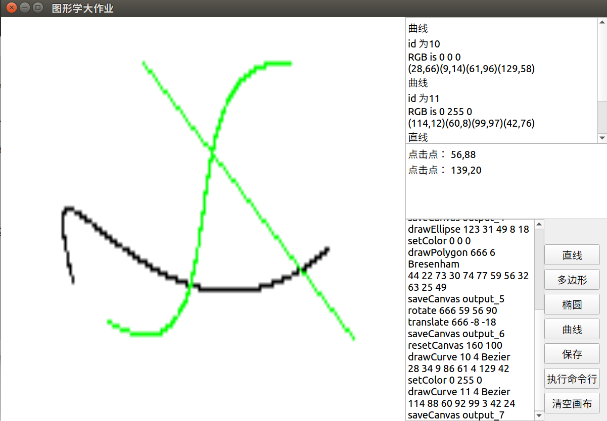

## 实现语言，运行平台及依赖
Python 3 (Python 2不兼容), 使用PyQt5进行图形化界面开发, 本机使用ubuntu16.04进行测试，无需编译，跨平台。本大作业依赖PyQt5，使用时需要下载PyQt：pip3 install PyQt5

## 项目结构

命令行与图形化界面入口程序：graphic.py

画布管理类：canvas.py

绘制图元类：line.py polygon.py curve.py

BMP文件生成类：bmp.py

## 命令行界面 CLI

### 进行过的测试
以`python3 graphic.py cmd.txt`为命令进行了测试，cmd.txt中的测试为群中测试样例，测试结果与样例所示结果吻合。

### 命令行可用命令

所实现命令严格按照要求实现，其中`drawPolygon`和`drawCurve`的节点或控制节点应另起一行输入，如群中所提供测试文件`input.txt`中一样。

1. `resetCanvas width height` 重置指定宽高的新画布

2. `saveCanvas name` 保存为名为name的bmp文件（不会自动添加后缀）

3. `setColor R G B` 设置画笔颜色为RGB所代表的文件

4. `drawLine id x1 y1 x2 y2 algorithm` 从 (x1, y1) 出发绘制线段到 (x2, y2)，支持`DDA`和`Bresenham`算法

5. `drawPolygon id n algorithm ....`，使用`algorithm`所代表的算法绘制多边形，支持`DDA`和`Bresenham`

6. `drawEllipse id x y rx ry`，使用中心椭圆`Bresenham`算法绘制椭圆

7. `drawCurve id n algorithm ...`，使用`algorithm`所代表的算法绘制椭圆，支持`Bezier`和`B-spline`算法。

8. `translate id dx dy`，id所标示的图元平移dx，dy

9. `rotate id dx dy r`，id所标示的图元根据所选中心做顺时针角度制旋转r度

10. `scale id dx dy r`，id所标示的图元根据所选中心做r倍的缩放

11. `clip id x1 y1 x2 y2 algorithm`，使用`algorithm`所代表的算法进行线段剪裁，算法支持`Cohen-Sutherland`和`Liang-Barsky`

## 图形化界面 GUI

###图形化界面功能

绘制直线，多边形，椭圆，曲线，保存为`output.bmp`图片，执行命令行程序，清空画布。

### 进行过的测试
使用`python3 graphic.py`命令启动图形化界面后，进行了简单的各种图形绘制，以及命令行命令的执行。其中命令行测试使用了群中提供的`input.txt`测试样例。

### 图形化界面使用指南

### 画布
画布在窗口左上角，固定大小为800x800，背景为白色。

###图元信息区
右上角会按照顺序列出所有存在的图元的相关信息：图元类型，颜色，id，控制点

###动态返回信息区
右边第二个文本框会对鼠标点击进行实施反馈，告知使用者当前所进行的操作是绘制何种图元，操作完成后会提示绘制成功，绘制期间会显示点击过的所有点的坐标。应对其他按钮的点击也会输出一些帮助与反馈信息。

###命令行执行区
右下角的文本框为命令行执行区域。可以输入命令行命令并点击右下角的执行命令行进行执行。

### 按钮
按钮位于图形化界面的右下角
#### 清空画布
点击清除按钮，将会执行`resetCanvas`命令，即清除本画布上的所有图元。并将图元的编号重新以0开始记。
#### 线段按钮
按下此按钮后，需要在画布上点击两次，作为线段的起始点和终止点。默认使用`Bresenham`算法绘制。
#### 多边形按钮
按下此按钮后，点击画布上若干次，再点击此多边形按钮即可绘制出多边形。默认使用`Bresenham`算法绘制。
#### 椭圆按钮 
按下此按钮后，在画布上点击三次，第一次点击的点（x,y）为椭圆中心点，第二次点击的点（x2，y2）用于计算x轴半径：x2-x，第三次点击的点（x3,y3）用于确定y轴的半径：y3-y。再次点击多边形按钮即可绘制椭圆，使用的算法为中心圆算法。
#### 曲线按钮
与多边形按钮类似，点击画布若干次，再点击此曲线按钮绘制出曲线。默认使用`B-spline`算法。
#### 保存按钮
按下此按钮后，当前画布会被保存为图像输出为当前文件夹下的`output.bmp`文件。
#### 执行命令行按钮
按下按钮后，以命令行的形式执行右下角文本框中的文字。

## 运行图示例

